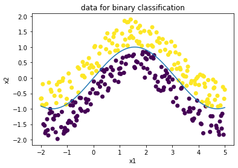

# lime
a minimal walk through lime

## what is the task?
we have access to a high capacity black box model `f`, capable of fitting nonlinear decision boundaries. 

can we use it to fit a linear model within a small subspace of our input, so that we can readily identify important features?

## data for binary classification

we generate data for binary classification with a nonlinear decision boundary (represented as a sine curve). 

